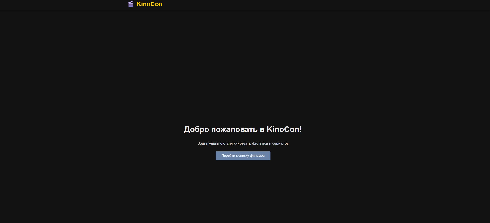
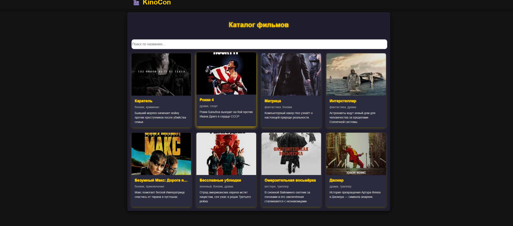
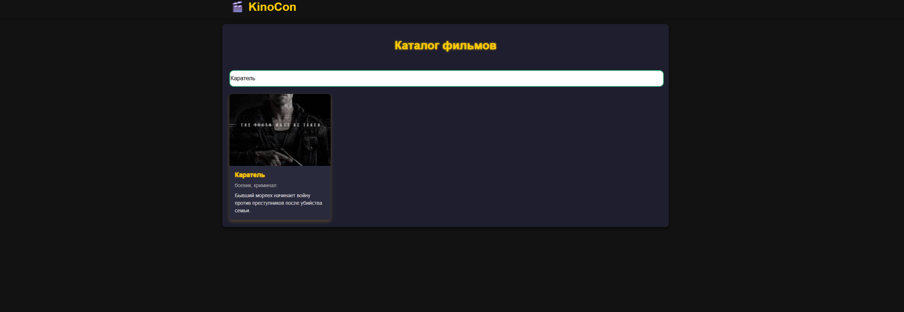
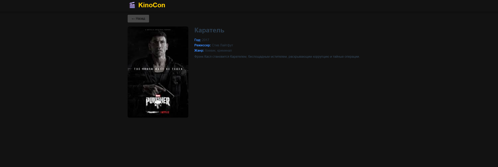

### Как запустить KinoCon

# 1)Установка зависимостей 
     npm install 
# 2)Запуск сервера разработки 
    npm run serve

## После появится сслыка на рабочий локальный сервер 
     http://localhost:8080/

# Главное меню

#  Каталог фильмов

# Избражение рабочей строки поиска

# Страница фильма или сериала

